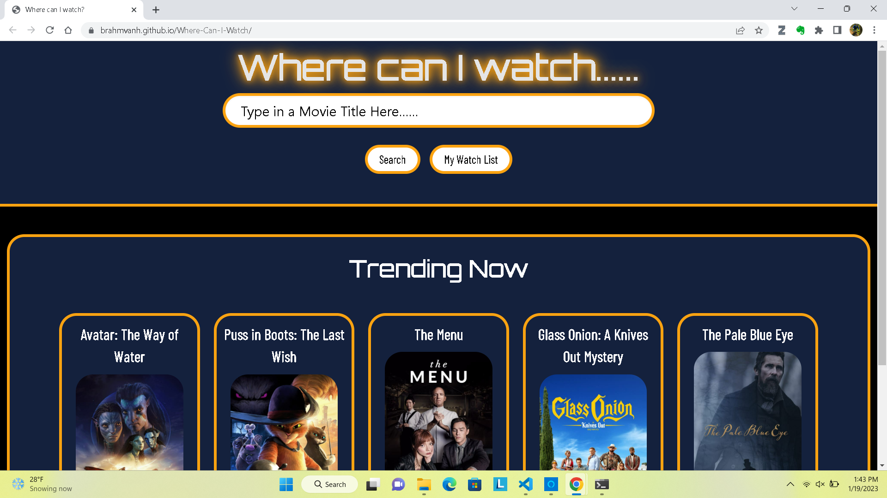

## Where Can I Watch...?

# Description

This is an application created to allow users to search for a movie title of their interest and recieve information on the movie production, as well as links to external sources to find more information on the title. The application also offers updated, to the week, current trending movie titles. 

Link to deployed application: 
https://brahmvanh.github.io/Where-Can-I-Watch/

# Installation

N/A

# Usage

This application can be used on most browsers, as well as most modern portable devices. The application utilizes breakpoints to allow for efficient and appropriate display parameters on most modern devices. 

# Credits

Mike Rose, GitHub: https://github.com/Mrose332
K.D. Nagpal, GitHub: https://github.com/KDNagpal
Brahm Van Houzen, GitHub: https://github.com/BrahmVanH

# License

Please refer to license in Repo.
